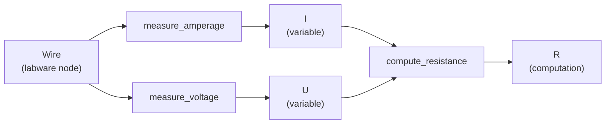
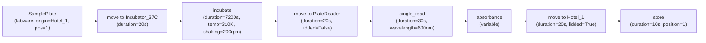
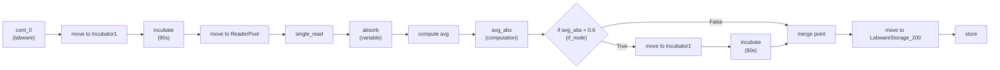
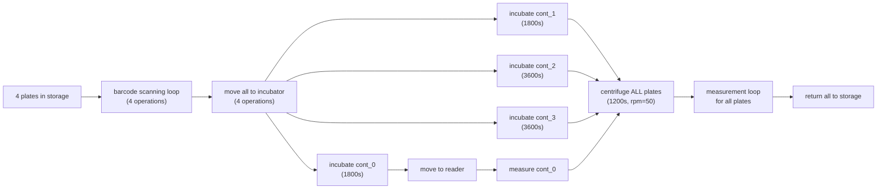
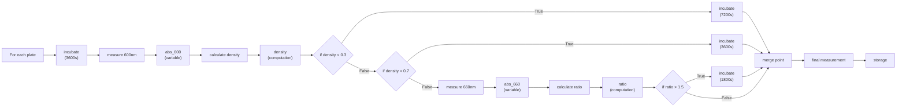

# Example Processes

This document provides complete examples of PLProcessReader-compliant processes, from simple to complex.

## Basic Physics Process

This minimal example demonstrates:
- Creating a custom ServiceResource
- Defining runtime variables
- Computing derived values

### Code

```python
from pythonlab.resource import ServiceResource, LabwareResource
from pythonlab.process import PLProcess

class VoltMeterServiceResource(ServiceResource):
    """Custom service for voltage/current measurement."""

    def measure_amperage(self, cont: LabwareResource, **kwargs):
        """
        Measure electric current through a conductor.

        Args:
            cont: Conductor to measure (wire, circuit, etc.)

        Returns:
            Runtime variable representing current in Amperes
        """
        kwargs.update(dict(
            fct='meas_current',
            duration=1  # 1 second measurement
        ))
        self.proc.add_process_step(self, [cont], **kwargs)

    def measure_voltage(self, cont: LabwareResource, **kwargs):
        """
        Measure voltage across a conductor.

        Args:
            cont: Conductor to measure

        Returns:
            Runtime variable representing voltage in Volts
        """
        kwargs.update(dict(
            fct='meas_voltage',
            duration=1  # 1 second measurement
        ))
        self.proc.add_process_step(self, [cont], **kwargs)


class PhysicsMiniProcess(PLProcess):
    """
    Minimal physics experiment: measure voltage and current, calculate resistance.

    Demonstrates Ohm's law: R = U / I
    """

    def create_resources(self):
        # Create measurement device
        self.voltmeter = VoltMeterServiceResource(proc=self, name="MyVoltmeter")

        # Create test subject (wire)
        self.wire = LabwareResource(proc=self, name="Wire")

    def init_service_resources(self):
        super().init_service_resources()

    def compute_resistance(self, u, i):
        """
        Calculate resistance from voltage and current.

        Args:
            u: Voltage in Volts
            i: Current in Amperes

        Returns:
            Resistance in Ohms
        """
        return u / i

    def process(self):
        # Measure current (runtime variable)
        I = self.voltmeter.measure_amperage(self.wire)

        # Measure voltage (runtime variable)
        U = self.voltmeter.measure_voltage(self.wire)

        # Compute resistance (computation node)
        R = self.compute_resistance(U, I)
```

### Resulting Workflow



### Key Concepts

- **Custom ServiceResource**: VoltMeterServiceResource defines two operations
- **Runtime variables**: I and U are values from measurements
- **Computation node**: R is derived from runtime variables
- **Simple workflow**: Sequential measurements followed by calculation

### Running the Example

```python
from pythonlab.pythonlab_reader import PLProcessReader

# Parse the process
simulator = PLProcessReader.parse_process(PhysicsMiniProcess())

# Visualize
simulator.visualize_workflow_graph()

# Check nodes
print(f"Nodes: {simulator.workflow.number_of_nodes()}")  # 5 nodes
print(f"Edges: {simulator.workflow.number_of_edges()}")  # 4 edges
```

---

## Simple Bioprocess

A basic biological process with incubation and measurement.

### Code

```python
from pythonlab.process import PLProcess
from pythonlab.resource import LabwareResource
from pythonlab.resources.services.incubation import IncubatorServiceResource
from pythonlab.resources.services.moving import MoverServiceResource
from pythonlab.resources.services.analysis import PlateReaderServiceResource
from pythonlab.resources.services.labware_storage import LabwareStorageResource


class SimpleBioProcess(PLProcess):
    """
    Basic bioprocess: incubate sample, measure absorbance, return to storage.
    """

    def create_resources(self):
        # Create services
        self.storage = LabwareStorageResource(proc=self, name="Hotel_1")
        self.mover = MoverServiceResource(proc=self, name="RobotArm")
        self.incubator = IncubatorServiceResource(proc=self, name="Incubator_37C")
        self.reader = PlateReaderServiceResource(proc=self, name="PlateReader")

        # Create labware
        self.plate = LabwareResource(proc=self, name="SamplePlate", lidded=True)

    def init_service_resources(self):
        super().init_service_resources()

        # Plate starts in storage
        self.plate.set_start_position(self.storage, position=1)

    def process(self):
        # Move to incubator
        self.mover.move(self.plate, target_loc=self.incubator, lidded=True)

        # Incubate for 2 hours at 37°C
        self.incubator.incubate(
            self.plate,
            duration=7200,      # 2 hours = 7200 seconds
            temperature=310,    # 37°C = 310 Kelvin
            shaking_frequency=200
        )

        # Move to reader (remove lid)
        self.mover.move(self.plate, target_loc=self.reader, lidded=False)

        # Measure absorbance at 600nm
        absorbance = self.reader.single_read(
            self.plate,
            wavelengths=[600],
            temperature=305
        )

        # Return to storage (with lid)
        self.mover.move(self.plate, target_loc=self.storage, lidded=True)
        self.storage.store(self.plate, position=1)
```

### Resulting Workflow



### Key Concepts

- **Movement operations**: Use MoverServiceResource to move between devices
- **Lid management**: Track whether labware is lidded during operations
- **Starting position**: Plate begins in storage
- **Linear workflow**: No branching, just sequential operations

---

## Runtime Decision Process

Demonstrates runtime conditional branching based on measurements.

### Code

```python
from pythonlab.process import PLProcess
from pythonlab.resource import LabwareResource
from pythonlab.resources.services.incubation import IncubatorServiceResource
from pythonlab.resources.services.moving import MoverServiceResource
from pythonlab.resources.services.analysis import PlateReaderServiceResource
from pythonlab.resources.services.labware_storage import LabwareStorageResource
from random import random


class RuntimeDecisionProcess(PLProcess):
    """
    Demonstrates runtime decision-making:
    - Incubate sample
    - Measure absorbance
    - If OD < 0.6, continue incubation
    - Return to storage
    """

    def create_resources(self):
        # Create services
        self.storage = LabwareStorageResource(proc=self, name="LabwareStorage_200")
        self.incubator = IncubatorServiceResource(proc=self, name="Incubator1")
        self.mover = MoverServiceResource(proc=self, name="MoverPool")
        self.reader = PlateReaderServiceResource(proc=self, name="ReaderPool")

        # Create labware
        self.labwares = [
            LabwareResource(proc=self, name=f"cont_{i}", lidded=True)
            for i in range(2)
        ]

    def init_service_resources(self):
        super().init_service_resources()

        # Set starting positions
        for cont in self.labwares:
            cont.set_start_position(
                self.storage,
                self.storage.next_free_position
            )

    def average(self, absorbance_data):
        """
        Compute average absorbance.

        In real execution, this would process measurement data.
        During parsing, this creates a computation node.
        """
        return sum(absorbance_data) / len(absorbance_data)

    def process(self):
        cont1 = self.labwares[0]
        incubation_duration = 80  # Short duration for demo

        # Move to incubator
        self.mover.move(cont1, target_loc=self.incubator, lidded=True)

        # Initial incubation
        self.incubator.incubate(
            cont1,
            duration=incubation_duration,
            temperature=310
        )

        # Move to reader for measurement
        self.mover.move(cont1, target_loc=self.reader, lidded=False)

        # Measure absorbance (runtime variable)
        absorb = self.reader.single_read(
            cont1,
            method='211001_single_well_600'
        )

        # Compute average (computation node)
        avg_abs = self.average(absorb)

        # RUNTIME DECISION: based on measurement result
        if avg_abs < 0.6:
            # Low density - need more incubation
            self.mover.move(cont1, target_loc=self.incubator, lidded=True)
            self.incubator.incubate(
                cont1,
                duration=incubation_duration,
                temperature=310
            )

        # If branch continues here automatically

        # Return to storage
        self.mover.move(cont1, target_loc=self.storage, lidded=True)
        self.storage.store(cont1)
```

### Resulting Workflow



### Key Concepts

- **Runtime variable**: `absorb` from measurement
- **Computation**: `avg_abs` derived from runtime variable
- **If-node**: Decision point with both branches in graph
- **Optional branch**: True branch adds extra incubation
- **Convergence**: Both branches merge before final storage

### Running the Example

```python
simulator = PLProcessReader.parse_process(RuntimeDecisionProcess())

# Find the if-node
if_nodes = [
    (nid, data) for nid, data in simulator.workflow.nodes(data=True)
    if data['type'] == 'if_node'
]

print(f"If-nodes: {len(if_nodes)}")  # 1 if-node
print(f"Condition: {if_nodes[0][1]['name']}")  # "if avg_abs < 0.6"
```

---

## Growth and Centrifugation Process

**Source:** `tests/test_data/growth_centrifugation_process.py`

Complex process with loops, multiple devices, and parallel operations.

### Code

```python
from pythonlab.process import PLProcess
from pythonlab.resource import LabwareResource
from pythonlab.resources.services.incubation import IncubatorServiceResource
from pythonlab.resources.services.moving import MoverServiceResource
from pythonlab.resources.services.analysis import PlateReaderServiceResource
from pythonlab.resources.services.centrifugation import CentrifugeServiceResource
from pythonlab.resources.services.labware_storage import LabwareStorageResource


class GrowthCentrifugationProcess(PLProcess):
    """
    Complex bioprocess demonstrating:
    - Multiple samples (4 plates)
    - Barcode scanning
    - Different incubation times
    - Centrifugation of multiple plates
    - Multiple measurement points
    """

    def create_resources(self):
        # Create services
        self.storage = LabwareStorageResource(proc=self, name="LabwareStorage_200")
        self.incubator = IncubatorServiceResource(proc=self, name="Incubator1")
        self.mover = MoverServiceResource(proc=self, name="MoverArm")
        self.reader = PlateReaderServiceResource(proc=self, name="MTPSpectroPhotometer")
        self.centrifuge = CentrifugeServiceResource(proc=self, name="Centrifuge")

        # Create 4 experimental plates
        self.labwares = [
            LabwareResource(
                proc=self,
                name=f"expr_cont_{i}",
                lidded=True,
                filled=False
            )
            for i in range(4)
        ]

    def init_service_resources(self):
        super().init_service_resources()

        # All plates start in storage
        for cont in self.labwares:
            cont.set_start_position(
                self.storage,
                self.storage.next_free_position
            )

    def process(self):
        # Step 1: Scan all barcodes
        for cont in self.labwares:
            self.mover.read_barcode(cont)

        # Step 2: Move all plates to incubator
        for cont in self.labwares:
            self.mover.move(cont, target_loc=self.incubator, lidded=True)

        # Step 3: Different incubation protocols for different plates
        cont1, cont2, cont3, cont4 = self.labwares

        # First two plates: 30 minute incubation
        self.incubator.incubate(cont1, duration=1800, temperature=310)
        self.incubator.incubate(cont2, duration=1800, temperature=310)

        # Measure first plate
        self.mover.move(cont1, target_loc=self.reader, lidded=False)
        self.reader.single_read(
            cont1,
            wavelengths=[600, 660],
            method='multi_wavelength_protocol'
        )

        # Last two plates: 1 hour incubation
        self.incubator.incubate(cont3, duration=3600, temperature=310)
        self.incubator.incubate(cont4, duration=3600, temperature=310)

        # Step 4: Centrifuge all plates together
        self.centrifuge.centrifuge(
            labwares=self.labwares,
            duration=1200,   # 20 minutes
            rpm=50           # Low speed
        )

        # Step 5: Final measurements for all plates
        for cont in self.labwares:
            self.mover.move(cont, target_loc=self.reader, lidded=False)
            self.reader.single_read(
                cont,
                wavelengths=[600, 660],
                method='final_measurement'
            )

        # Step 6: Return all to storage
        for cont in self.labwares:
            self.mover.move(cont, target_loc=self.storage, lidded=True)
            self.storage.store(cont)
```

### Workflow Highlights



### Key Concepts

- **Loop unrolling**: For loops create separate nodes for each iteration
- **Multiple labware**: Some operations involve multiple containers
- **Parallel operations**: Some steps can potentially run in parallel
- **Centrifuge**: Single operation on multiple containers
- **Different protocols**: Different incubation times for different samples

---

## Complex Multi-Decision Process

A more advanced example with multiple runtime decision points.

### Code

```python
from pythonlab.process import PLProcess
from pythonlab.resource import LabwareResource
from pythonlab.resources.services.incubation import IncubatorServiceResource
from pythonlab.resources.services.moving import MoverServiceResource
from pythonlab.resources.services.analysis import PlateReaderServiceResource
from pythonlab.resources.services.labware_storage import LabwareStorageResource


class ComplexDecisionProcess(PLProcess):
    """
    Advanced process with multiple decision points:
    - Screen multiple samples
    - Make different decisions for each based on measurements
    - Hierarchical decisions (if-elif-else pattern)
    """

    def create_resources(self):
        # Services
        self.storage = LabwareStorageResource(proc=self, name="Storage")
        self.mover = MoverServiceResource(proc=self, name="Mover")
        self.incubator = IncubatorServiceResource(proc=self, name="Incubator")
        self.reader = PlateReaderServiceResource(proc=self, name="Reader")

        # Multiple sample plates
        self.plates = [
            LabwareResource(proc=self, name=f"Sample_{i}", lidded=True)
            for i in range(3)
        ]

    def init_service_resources(self):
        super().init_service_resources()

        for plate in self.plates:
            plate.set_start_position(
                self.storage,
                self.storage.next_free_position
            )

    def calculate_density(self, absorbance):
        """Convert absorbance to cell density."""
        return absorbance * 1.2  # Simplified conversion

    def calculate_ratio(self, abs1, abs2):
        """Calculate ratio of two absorbances."""
        return abs1 / abs2

    def process(self):
        # Process each plate with runtime decisions
        for plate in self.plates:
            # Initial growth phase
            self.mover.move(plate, target_loc=self.incubator)
            self.incubator.incubate(plate, duration=3600, temperature=310)

            # Initial measurement
            self.mover.move(plate, target_loc=self.reader, lidded=False)
            abs_600 = self.reader.single_read(plate, wavelengths=[600])
            density = self.calculate_density(abs_600)

            # HIERARCHICAL DECISION TREE
            if density < 0.3:
                # Low density - long incubation
                self.mover.move(plate, target_loc=self.incubator, lidded=True)
                self.incubator.incubate(plate, duration=7200, temperature=310)

            elif density < 0.7:
                # Medium density - short incubation
                self.mover.move(plate, target_loc=self.incubator, lidded=True)
                self.incubator.incubate(plate, duration=3600, temperature=310)

            else:
                # High density - measure at multiple wavelengths
                abs_660 = self.reader.single_read(plate, wavelengths=[660])
                ratio = self.calculate_ratio(abs_600, abs_660)

                # NESTED DECISION
                if ratio > 1.5:
                    # High ratio - additional processing
                    self.mover.move(plate, target_loc=self.incubator, lidded=True)
                    self.incubator.incubate(plate, duration=1800, temperature=315)

            # Final measurement (all branches converge here)
            self.mover.move(plate, target_loc=self.reader, lidded=False)
            final_abs = self.reader.single_read(plate, wavelengths=[600, 660])

            # Return to storage
            self.mover.move(plate, target_loc=self.storage, lidded=True)
            self.storage.store(plate)
```

### Workflow Structure



### Key Concepts

- **Loop with decisions**: Each iteration has runtime branching
- **If-elif-else**: Multiple exclusive branches
- **Nested decisions**: Decision within a branch
- **Multiple measurements**: Different wavelengths based on conditions
- **Convergence**: All branches merge before final measurement

---

## Running Examples

### Parse and Analyze

```python
from pythonlab.pythonlab_reader import PLProcessReader

# Parse any of the examples
simulator = PLProcessReader.parse_process(GrowthCentrifugationProcess())

# Get statistics
print(f"Total nodes: {simulator.workflow.number_of_nodes()}")
print(f"Total edges: {simulator.workflow.number_of_edges()}")

# Count node types
from collections import Counter
node_types = Counter(
    data['type'] for _, data in simulator.workflow.nodes(data=True)
)
print(f"Node type counts: {dict(node_types)}")

# Find operations
operations = [
    data['name'] for _, data in simulator.workflow.nodes(data=True)
    if data['type'] == 'operation'
]
print(f"Operations: {operations}")
```

### Visualize

```python
# Built-in visualization
simulator.visualize_workflow_graph(show=True)
```

### Export Graph

```python
import networkx as nx

# Export to GraphML (for Cytoscape, yEd, etc.)
nx.write_graphml(simulator.workflow, "workflow.graphml")

# Export to JSON
import json
from networkx.readwrite import json_graph

graph_json = json_graph.node_link_data(simulator.workflow)
with open("workflow.json", "w") as f:
    json.dump(graph_json, f, indent=2)

# Export to DOT (for Graphviz)
nx.drawing.nx_pydot.write_dot(simulator.workflow, "workflow.dot")
```

### Calculate Critical Path

```python
import networkx as nx

# Ensure all nodes have duration
for node in simulator.workflow.nodes():
    if 'duration' not in simulator.workflow.nodes[node]:
        simulator.workflow.nodes[node]['duration'] = 0

# Find longest path (critical path)
try:
    critical_path = nx.dag_longest_path(
        simulator.workflow,
        weight='duration'
    )

    # Calculate total time
    total_time = sum(
        simulator.workflow.nodes[n].get('duration', 0)
        for n in critical_path
    )

    print(f"Critical path: {critical_path}")
    print(f"Minimum execution time: {total_time} seconds")
    print(f"                     = {total_time / 60:.1f} minutes")
    print(f"                     = {total_time / 3600:.2f} hours")

except nx.NetworkXException as e:
    print(f"Error calculating critical path: {e}")
```
